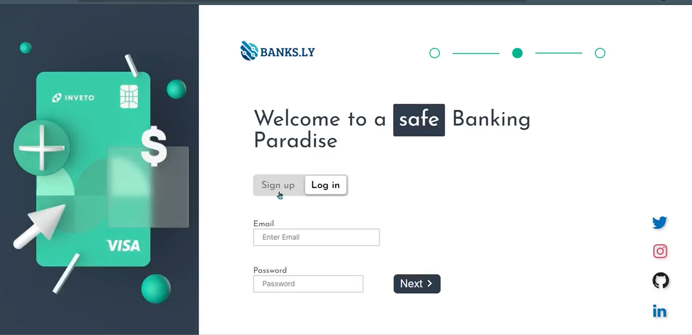
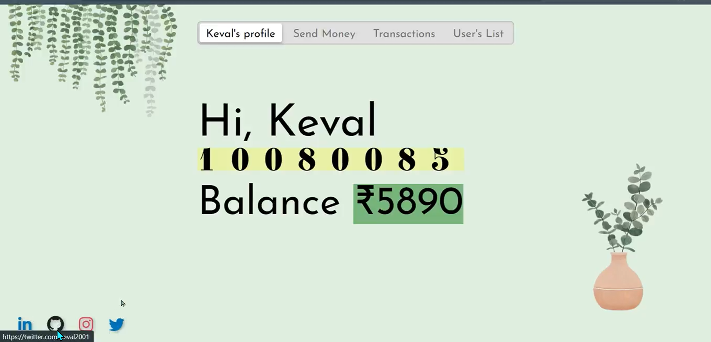
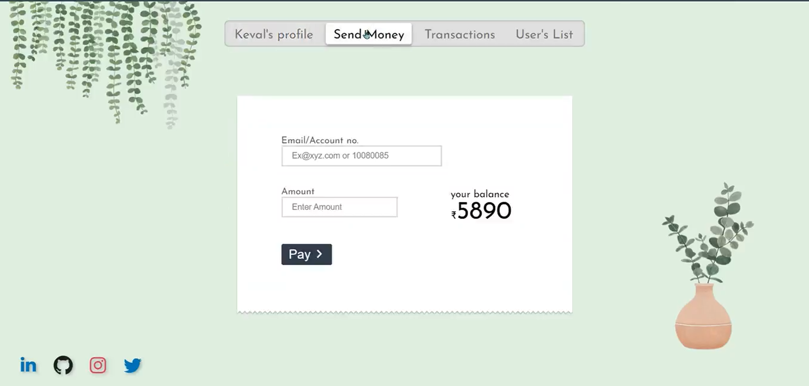
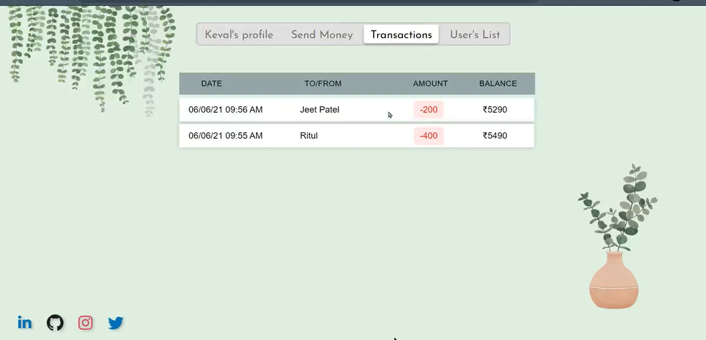

# Spark Bank Web App

A full-stack web application built with PHP, HTML, and JavaScript, allowing users to securely sign up, log in, and manage transactions. This app utilizes asynchronous requests for smooth interaction and SQL for database management.

## Project Migration
This project was originally part of [Original Repository](https://github.com/Keval9shah/web/tree/pathfinder/algorithm/spbank). However, it has been moved to this new repository for better project organization and development focus.

## Features
- User authentication (sign-up, log-in)
- Transaction tracking and history
- Unique user interface
- SQL for transaction and user data management

## Screenshots

|  |  |
|:-----------------------------------:|:-----------------------------------------------:|
|              Login Page             |                  Transaction Page               |
|  |          |
|              Transaction Page               |                Transaction History                   |